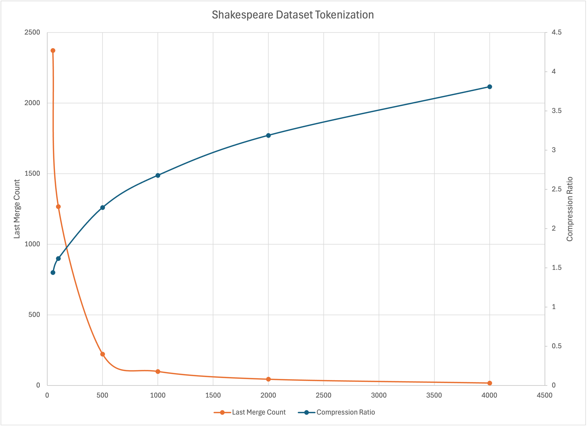

# Token Expiriment

I am building on what I leanred from Karpathy/build_gpt_from_scratch and Karpathy/tokenization to try and learn more about how tokenization affects the model results. I am taking the v2 model from the gpt and refactoring it into a library. Then I will drive exiriments with the tokens from the main.py.

Expiriments I am interested in running
1. First I will record the result of the base tokenization, raw file. This uses the ascii characters and punctuation, with capitilization directly.
1. Next I will try to minimize the tokens by going to all lower case and removing all punctioation besides space and period. I expect this to reduce the expressivness of the results, but I hope it will make better sentences.
1. I will then try and run a basic tokenization using byte pair encoding, but keeping all the caps and punctuation and compare the results.
1. Maybe I will tokenize the reduced character set after that

## tokenization

This implementation provides a **Character Pair Encoding** tokenizer inspired by the Byte Pair Encoding Tokenizer. This one works directly with characters instead of UTF-8 bytes.

### Compression Performance

Based on experiments with the full input.txt dataset (base vocabulary: 65 characters):

| New Tokens | Total Vocab Size | Compression Ratio | Last Merge Occurrences |
|------------|------------------|-------------------|------------------------|
| 50         | 115              | 1.44x             | 2373                   |
| 100        | 165              | 1.62x             | 1267                   |
| 500        | 565              | 2.27x             | 223                    |
| 1000       | 1065             | 2.68x             | 100                    |
| 2000       | 2065             | 3.19x             | 45                     |
| 4000       | 4065             | 3.81x             | 18                     |

